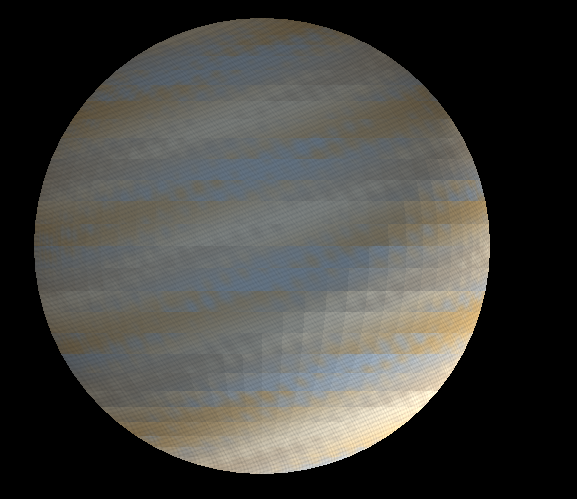
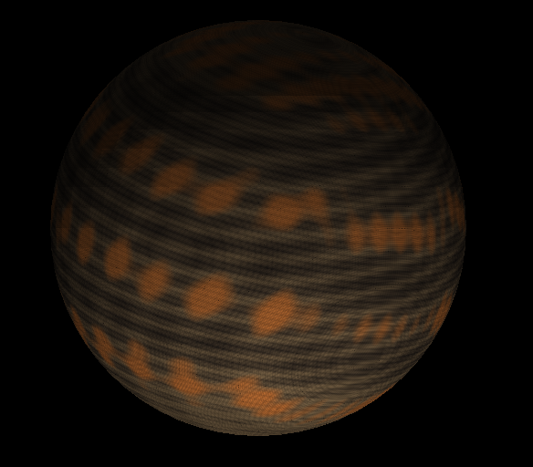
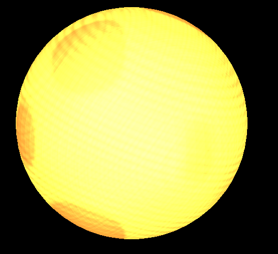

# Procedural Planet Renderer (Lab 5)

Este proyecto genera tres tipos de planetas procedurales completamente en CPU usando Rust y `minifb`:

1. Sistema Solar (Key 1) – Renderiza los tres planetas simultáneamente con posiciones y escalas distintas.
2. Planeta Rocoso (Key 2) – Estratos, polvo según pendiente, grietas, granulación y cráteres dispersos con patrón aleatorio por ejecución.
3. Sol / Estrella (Key 3) – Emisión uniforme, turbulencia energética, manchas solares suavizadas y brillo sin sombras.
4. Planeta Gaseoso (Key 4) – Bandas de nubes suaves en tonos crema, tan, ocre y azul-gris, con turbulencia y rim atmosférico.

## Características Técnicas
- Pipeline manual: Vertex transform → ensamblado → rasterización → shading procedural per-fragment.
- Normales transformadas con matriz inversa transpuesta (para iluminación y patrones dependientes de orientación).
- Shaders totalmente procedurales sin texturas externas; solo funciones trigonométricas y combinaciones.
- Semilla global de ruido para variación del planeta rocoso en cada ejecución.

## Controles
| Tecla | Acción |
|-------|-------|
| Flechas / WASD | Mover el modelo (X/Y en pantalla) |
| Z / X | Zoom in / Zoom out |
| Q / W | Rotar sobre eje X |
| E / R | Rotar sobre eje Y |
| T / Y | Rotar sobre eje Z |
| 1 | Mostrar los tres planetas (modo sistema solar) |
| 2 | Shader rocoso |
| 3 | Sol |
| 4 | Shader gaseoso |
| Esc | Salir |

## Requisitos
- Rust (stable) y `cargo`.
- Plataforma probada: Windows (PowerShell). Debe funcionar en otros sistemas sin cambios.

## Compilación y Ejecución
```bash
cargo run --release
```
(En PowerShell simplemente: `cargo run --release`)

## Estructura Importante
- `src/shaders.rs`: Implementación de todos los shaders y semilla aleatoria.
- `src/main.rs`: Loop principal, entrada de teclado y seeding inicial.
- `assets/models/planetaff.obj`: Modelo base usado para todos los planetas.


### Planeta Gaseoso


### Planeta Rocoso


### Sol / Estrella



