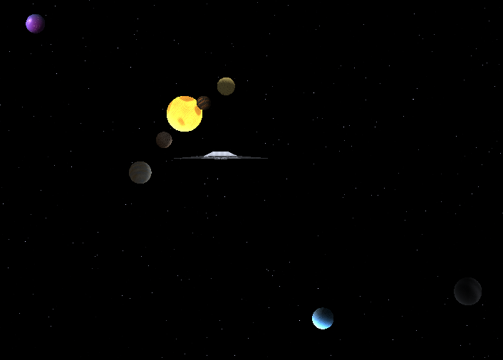
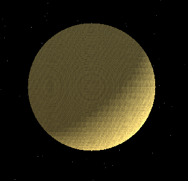
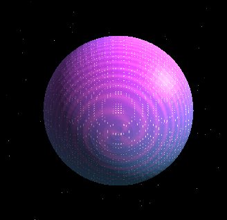
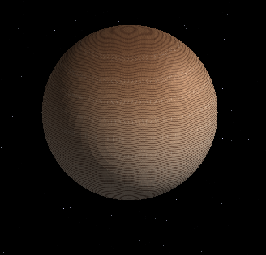
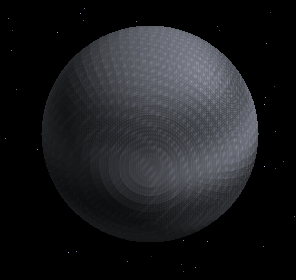
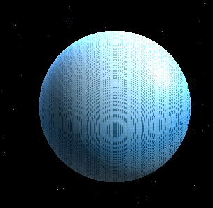

# Lab 5 – Solar System Warp Renderer

Renderizador completamente en CPU escrito en Rust que combina rasterización manual, shaders procedurales y un modo de “warp drive” instantáneo inspirado en ciencia ficción. Todo el pipeline (transformación, ensamblado de triángulos, raster y shading) corre sobre la CPU usando `minifb` para la ventana.

## Características principales
- **Sistema solar interactivo** con ocho instancias planetarias, órbitas elípticas, escalas diferenciadas y una nave HUD anclada al frente de la cámara.
- **Shaders procedurales** (rocoso, gaseoso, estelar, burbuja, hielo, gato, etc.) que no dependen de texturas externas; cada ejecución usa semillas de ruido distintas para variar detalles.
- **Cielo dinámico** basado en starfield procedimental y efecto de parallax dependiente del desplazamiento de cámara.
- **Warp instantáneo**: al presionar `Space` se dispara una animación de carga luminosa; al completarse, la cámara se teletransporta a un punto aleatorio dentro del sistema.
- **Controles duales**: modo sistema solar con zoom global y modo planeta individual donde se puede rotar/escaliar el modelo cargado desde `assets/models/planetaff.obj`.

## Controles
| Tecla | Acción |
|-------|-------|
| Flechas / WASD | Desplazar la cámara en pantalla |
| Z / X (modo solar) | Zoom in / out del sistema completo |
| Z / X (modo individual) | Escala del planeta aislado |
| Q / U | Rotación sobre eje X |
| E / R | Rotación sobre eje Y |
| T / Y | Rotación sobre eje Z |
| 1 | Activar modo sistema solar completo |
| 2 – 9 | Ver shaders individuales (rocoso, sol, gaseoso y variantes experimentales) |
| Space | Iniciar secuencia de warp (flash azul y salto aleatorio) |
| Esc | Salir |

## Requisitos
- Rust estable (se probó con `cargo` 1.80+ en Windows, pero debe compilar en cualquier SO soportado por Rust).
- GPU no requerida: todo se ejecuta vía CPU y framebuffer propio.

## Compilación y ejecución
```powershell
cargo run --release
```
> Sugerido usar el perfil `--release` para aprovechar las optimizaciones cuando el warp dibuja todo el framebuffer.

## Arquitectura y archivos clave
- `src/main.rs`: bucle principal, control de entrada, animaciones orbitales y lógica del warp.
- `src/framebuffer.rs`: framebuffer/z-buffer personalizados y utilidades para escribir píxeles sin pasar por OpenGL.
- `src/shaders.rs`: colección de shaders procedurales usados por cada planeta.
- `assets/models/*.obj`: geometrías base (planetaff, nave, etc.).
- `docs/images`: capturas de referencia de algunos shaders.

## Galería rápida

### Sistema solar


### Planeta gaseoso


### Planeta rocoso


### Sol / estrella


### Planeta queso


### Planeta burbuja


### Planeta gato


### Gigante gris


### Planeta de hielo


## Link al video
https://drive.google.com/drive/folders/1t7j4SSQ6dNopixBCfccIV2OI8zwALauo?usp=sharing
